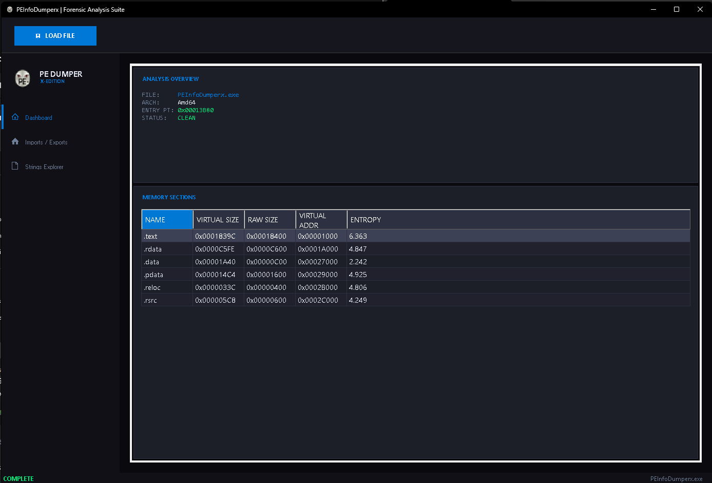

# PEInfoDumperx | X-Edition Forensic Suite

An advanced, GUI-based forensic analysis suite designed for inspecting Windows Portable Executable (PE) files. Built with a custom, sleek "Cyberpunk Forensic" dark theme, this tool allows malware analysts, reverse engineers, and developers to quickly dissect executable structures, analyze memory sections, and extract critical intelligence from binaries.

## 📌 Features

* **Dark Forensic GUI:** Custom-built interface with smooth animations and a specialized dark theme for extended analysis sessions.
* **Smart Drag & Drop:** Seamlessly load `.exe`, `.dll`, or `.sys` files directly into the dashboard.
* **Core PE Inspection:** Detects architecture (x86, x64, ARM64), Entry Point RVA, subsystem, and compilation details.
* **Entropy & Section Analysis:** Lists all memory sections (Virtual/Raw Size & Address) and automatically flags potentially packed or crypted payloads based on high entropy values (> 7.4).
* **IAT & EAT Parsing:** Explores the Import Address Table (tree-view of imported DLLs and functions) and Export Address Table.
* **Strings Explorer:** Extremely fast string extraction with real-time filtering capabilities.

## 🚀 Usage

1. Download the latest release or compile the project from source using Visual Studio.
2. Run `PEInfoDumperx.exe`.
3. Drag and drop any PE binary onto the main dashboard, or click the **LOAD FILE** button.
4. Navigate through the *Dashboard*, *Imports / Exports*, and *Strings Explorer* tabs to analyze the file.

## 🛠️ Built With

* C# (.NET 10.0 Windows)
* Windows Forms (Custom UI & Animation Engine)
* System.Reflection.PortableExecutable

## 📚 Educational Purpose

This tool was developed as a learning project to deeply understand the internal structure of Windows executables and malware analysis techniques. It is intended for **educational and research purposes only**. 

## 👤 Author

* **GitHub:** [@Kxeizy](https://github.com/Kxeizy)
* **Discord:** c0ffing

## 📄 License

This project is licensed under the MIT License - see the LICENSE file for details.